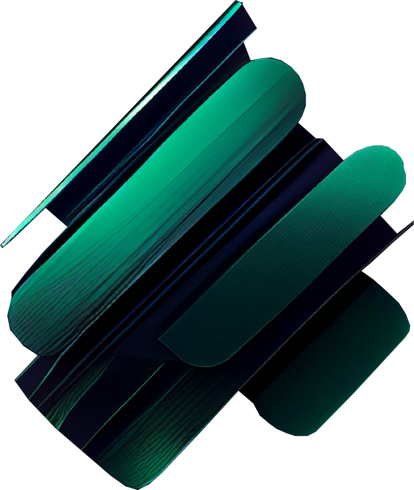

[![Contributors][contributors-shield]][contributors-url]
[![Downloads][downloads-shield]][downloads-url]
[![Issues][issues-shield]][issues-url]
[![MIT License][license-shield]][license-url]
[![LinkedIn][linkedin-shield]][linkedin-url]

<!-- PROJECT LOGO -->
<br />
<div align="center">
  <a href="https://vue-preloader.com" target="_blank">
    
  </a>

  <h3 align="center">Vue Preloader</h3>

  <p align="center">
    Valuable addition to any Vue.js or Nuxt.js project.
    <br />
    <br />
    <a href="https://vue-preloader.com/" target="_blank"><strong>View Demo</strong></a>
    <br />
    <br />
    <a href="https://vue-preloader.com/guide" target="_blank"><strong>Explore the docs »</strong></a>
    ·
    <a href="https://github.com/schnapsterdog/vue-preloader/issues target="_blank"">Report Bug</a>
    ·
    <a href="https://github.com/schnapsterdog/vue-preloader/issues target="_blank"">Request Feature</a>
    ·
    <a href="https://github.com/SchnapsterDog/vue2-preloader target="_blank"">Vue2 Version</a>
  </p>
</div>

<!-- ABOUT THE PROJECT -->
## About The Vue Preloader

[![Product Name Screen Shot][product-screenshot]](https://vue-preloader.com/)

vue-preloader is a versatile and easy-to-use Vue.js component that allows you to add loading animations to your Vue.js or Nuxt.js projects. It is compatible with both Vue 2 and Vue 3, making it a flexible choice for developers who may be using different versions of the framework.

One of the standout features of Vue-Preloader is its simplicity. Implementing the component is straightforward and can be done in just a few lines of code. Once installed, you can simply add the tag to your Vue or Nuxt template and customize the animation and appearance as desired.

Another great aspect of Vue-Preloader is its extendability. This makes it a great choice for developers who want to add unique loading animations that match their brand or projects style.

## Why to use Vue Preloader

- 👉 It is easy to use and set up within Nuxt3 or Vite Projects
- 👉 It allows for custom styling and customization options.
- 👉 It has a smooth and fluid animation.
- 👉 It is lightweight and performs well.
- 👉 It is open source and free to use.

<!-- GETTING STARTED -->
## Getting Started

With vue-preloader, you can easily create loading animation to your Vue.js or Nuxt.js projects.

### Installation

To use vue-preloader in your Vue or Nuxt.js project, simply install it with npm or yarn:
* npm
  ```sh
  npm i vue-preloader@latest --save
  ```

* yarn
  ```sh
  yarn add vue-preloader@latest
  ```

### Vite & Nuxt3

vue-preloader can easily be integrated into the layout of a Nuxt.js project or in a similar way in a Vite project. Firstly, you will need to register the the component inside script tag with setup:

```js
import { VuePreloader } from 'vue-preloader';
import '@/node_modules/vue-preloader/dist/style.css'
```
Than you can simply add the vue-preloader tag to your projects layout file:

layout/default.vue file in nuxt3:

```html
<div>
  <TemplatesHeader />
  <TemplatesPage>
	  <slot />
  </TemplatesPage>
  <TemplatesFooter />
  <VuePreloader
    background-color="#091a28"
    color="#ffffff"
    transition-type="fade-up"
    :loading-speed="25"
    :transition-speed="1400"
    @loading-is-over="loadingIsOver"
    @transition-is-over="transitionIsOver"
  ></VuePreloader>
</div>
```
### Slot & Slot Props

The vue-preloader component comes with a default slot that allows you to customize the content displayed within the preloader element. You can add any HTML or Vue.js template code within the slot to customize the look and feel of the preloader. This makes the component highly customizable and adaptable to any project's needs.

```html
<VuePreloader
  background-color="#091a28"
  color="#ffffff"
  transition-type="fade-up"
  :loading-speed="25"
  :transition-speed="1400"
>
  <span>You are awesome animation goes here</span>
</VuePreloader>
```

Color and percent as slotprops values that come directly from the component, together with the loading-is-over event can create powerful custom animations.

```html
<VuePreloader
  background-color="#091a28"
  color="#ffffff"
  transition-type="fade-up"
  :loading-speed="25"
  :transition-speed="1400"
  @loading-is-over="showAnimation = false"
  @transition-is-over="transitionIsOver"
>
  <template v-slot="{ percent, color }">
    <transition name="loading-animation" mode="in-out">
      <span
        v-if="showAnimation"
        :style="{ color }"
      >
        {{ percent }}
      </span>
    </transition>
  </template>
</VuePreloader>
```
```js
import { VuePreloader } from 'vue-preloader';
import '@/node_modules/vue-preloader/dist/style.css'
import { ref } from 'vue';

const showAnimation = ref(true)
```
### Transitions

The transition-type prop in the Vue preloader component specifies the type of fade animation that will be used when the preloader is removed from the screen. The transition-type prop accepts four possible values: fade-left, fade-right, fade-up, and fade-down. Each value specifies the direction in which the preloader will fade out of view. When the transition-type prop is not specified, the preloader will fade out of view towards the left.

```html
<VuePreloader
  background-color="#091a28"
  color="#ffffff"
  transition-type="fade-up"
  :loading-speed="25"
  :transition-speed="1400"
>
</VuePreloader>
```

```html
<VuePreloader
  background-color="#091a28"
  color="#ffffff"
  transition-type="fade-down"
  :loading-speed="25"
  :transition-speed="1400"
>
</VuePreloader>
```

```html
<VuePreloader
  background-color="#091a28"
  color="#ffffff"
  transition-type="fade-left"
  :loading-speed="25"
  :transition-speed="1400"
>
</VuePreloader>
```

```html
<VuePreloader
  background-color="#091a28"
  color="#ffffff"
  transition-type="fade-right"
  :loading-speed="25"
  :transition-speed="1400"
>
</VuePreloader>
```

### Available props

| Name | Type | Default | Description |
|--|--|--|--|
|**background-color**|`String`|`#091a28`|The prop background-color allows you to customize the background color of the preloader component. You can pass in a string value that represents a valid HEX color, such as #000000.
|**color**|`String`|`#ffffff`|This prop allows you to customize the color of loading bar.
|**loading-speed**|`Number`|`15`|The loading-speed prop is used to adjust the speed of the loading bar. You can pass in a number value that represents the animation speed in milliseconds. A lower value will result in a faster animation, while a higher value will slow it down. This prop can take an integer value.
|**overflow-active**|`Boolean`|`true`| Set overflow of the page
|**transition-speed**|`Number`|`1400`|The transition-speed prop is used to adjust the speed of the transition between the preloader and the main content of your application. You can pass in a number value that represents the transition speed in milliseconds. A lower value will result in a faster transition, while a higher value will slow it down.
|**transition-type**|`String`|`fade-left`|The transition-type prop accepts four possible values: fade-left, fade-right, fade-up, and fade-down. Each value specifies the direction in which the preloader will fade out of view. When the transition-type prop is not specified, the preloader will fade out of view towards the left.
|**transition-is-over**|`Event`|`/`|The event transition-is-over is fired when the transition is over and the component is no longer available in the DOM. It can be useful to create logic when the vue-loader should be re-rendered.
|**loading-is-over**|`Event`|`/`|The event loading-is-over is fired when the loading process is complete. This event can be useful to trigger other actions that depend on the completion of the loading process, such as displaying a success message or enabling certain user interactions.

## Vue2 Version

Version for Vue 2: [https://github.com/schnapsterdog/vue2-preloader](https://github.com/schnapsterdog/vue2-preloader)


<!-- CONTRIBUTING -->
## Contributing

Contributions are what make the open source community such an amazing place to learn, inspire, and create. Any contributions you make are **greatly appreciated**.

If you have a suggestion that would make this better, please fork the repo and create a pull request. You can also simply open an issue with the tag "enhancement".
Don't forget to give the project a star! Thanks again!

1. Fork the Project
2. Create your Feature Branch (`git checkout -b feature/AmazingFeature`)
3. Commit your Changes (`git commit -m 'Add some AmazingFeature'`)
4. Push to the Branch (`git push origin feature/AmazingFeature`)
5. Open a Pull Request


<!-- LICENSE -->
## License

Distributed under the MIT License. See `LICENSE.txt` for more information.

<!-- CONTACT -->
## Contact

Oliver Trajceski - [LinkedIn](https://mk.linkedin.com/in/oliver-trajceski-8a28b070) - oliver@akrinum.com

Project Link: [https://github.com/schnapsterdog/vue-preloader](https://github.com/schnapsterdog/vue-preloader)


<!-- ACKNOWLEDGMENTS -->
## Acknowledgments

Use this space to list resources you find helpful and would like to give credit to. I've included a few of my favorites to kick things off!

* [Choose an Open Source License](https://choosealicense.com)
* [Img Shields](https://shields.io)
* [GitHub Pages](https://pages.github.com)

<!-- MARKDOWN LINKS & IMAGES -->
<!-- https://www.markdownguide.org/basic-syntax/#reference-style-links -->
[contributors-shield]: https://img.shields.io/github/contributors/schnapsterdog/vue-preloader.svg?style=for-the-badge
[contributors-url]: https://github.com/schnapsterdog/vue-preloader/graphs/contributors
[downloads-shield]: https://img.shields.io/npm/dw/vue-preloader.svg?style=for-the-badge
[downloads-url]: https://www.npmjs.com/package/vue-preloader
[stars-shield]: https://img.shields.io/github/stars/vue-preloader.svg?style=for-the-badge
[stars-url]: https://github.com/schnapsterdog/vue-preloader/stargazers
[issues-shield]: https://img.shields.io/github/issues/schnapsterdog/vue-preloader.svg?style=for-the-badge
[issues-url]: https://github.com/schnapsterdog/vue-preloader/issues
[license-shield]: https://img.shields.io/github/license/schnapsterdog/vue-preloader.svg?style=for-the-badge
[license-url]: https://github.com/schnapsterdog/vue-preloader/blob/master/LICENSE.txt
[linkedin-shield]: https://img.shields.io/badge/-LinkedIn-black.svg?style=for-the-badge&logo=linkedin&colorB=555
[linkedin-url]: https://mk.linkedin.com/in/oliver-trajceski-8a28b070
[product-screenshot]: https://app.imgforce.com/images/user/bDm_1677186441_vue-preloader-seo.png
[Vue.js]: https://img.shields.io/badge/Vue.js-35495E?style=for-the-badge&logo=vuedotjs&logoColor=4FC08D
[Vue-url]: https://vuejs.org/